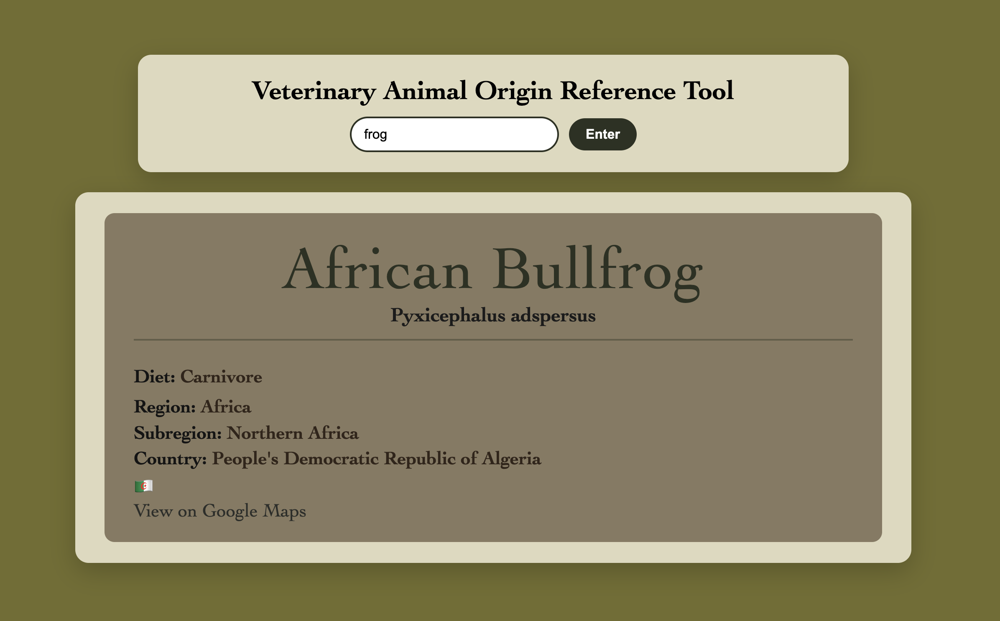

# 🐾 Veterinary Animal Origin Guide

A two-API reference application designed to help veterinary professionals quickly research unfamiliar animals and learn more about their biological characteristics and geographic origins.

---

## ✨ About the Project

The **Veterinary Animal Origin Guide** is a reference tool designed with veterinary practices in mind.

Veterinary professionals may encounter animals they are unfamiliar with, especially exotic or less common species. This application allows the user to search for an animal and quickly retrieve basic biological information about that animal along with information about its geographic origin.

The application connects **two APIs** so that information retrieved from the first API can automatically be used to search the second API.

---

## 🔎 How It Works

1. The user enters the name of an **animal**.
2. **API #1** searches for information about that animal.
3. The application displays information including the animal's:
   - 🐾 Name
   - 🔬 Scientific name
   - 🍽️ Diet
   - 🌍 Geographic region
4. The geographic region returned from API #1 is then passed into **API #2**.
5. API #2 uses that region to retrieve additional geographic information.
6. The application displays:
   - 🌎 The animal's region
   - 📍 A subregion
   - 🏳️ A country within that area
   - 🚩 The country's flag
   - 🗺️ A Google Maps link to the country
7. The user can click the map link to open the country's location in **Google Maps**.

---

## 🛠️ Built With

- HTML
- CSS
- JavaScript
- REST APIs
- Fetch API
- DOM Manipulation
- Google Maps Links

---

## 📸 Project Preview



---

## 💡 What I Practiced

This project gave me more experience working with **multiple APIs and passing data between API requests**.

Some of the skills I practiced include:

- Making API requests with `fetch()`
- Working with JSON data
- Accessing nested API data
- Using user input in an API request
- Retrieving animal information from an API
- Taking information from API #1 and using it in API #2
- Working with geographic data
- Dynamically displaying API results in the DOM
- Displaying country flag information
- Creating dynamic Google Maps links
- Building an application around a real-world veterinary use case

---

## 🚀 Run the Project

1. Clone the repository:

```bash
git clone https://github.com/smayanja3/complex-api-veterinary-practice.git
```

2. Open the project folder.
3. Open `index.html` in your browser.
4. Enter an animal to explore its biological information and geographic origin! 🐾🌍

Thanks for checking out my project! 🐾🩺🌎✨
